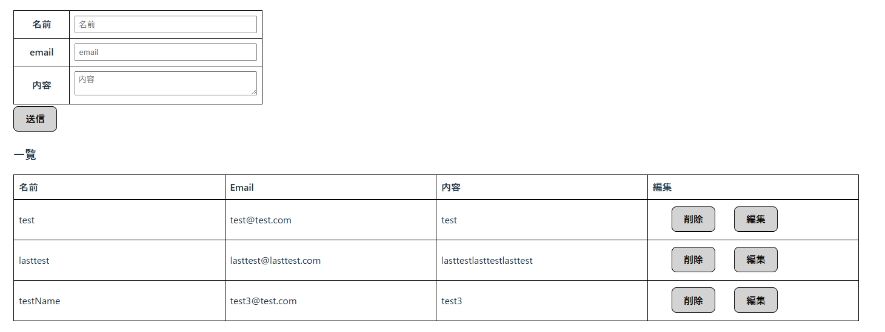
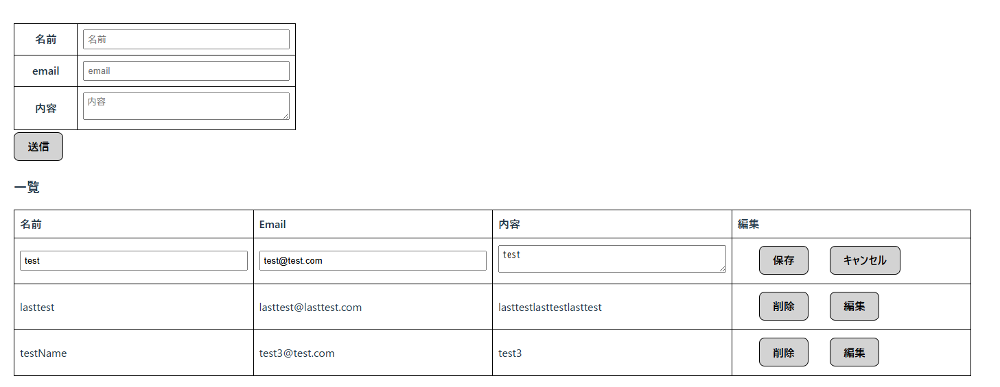
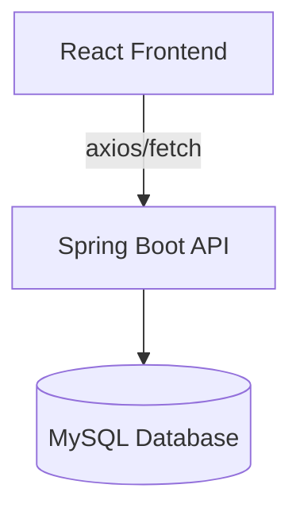

# Contact Form App (React + Spring Boot)

このシステムは、React + Spring Bootを使用した簡易リスト管理アプリケーションです。  
フロントエンドはReact + TypeScript、バックエンドはSpring BootでRESTful APIを構築し、CRUD処理を実装しています。

---

## 🌐 デモ（※準備中）
今後、AWS（ECS or Render or Vercel）にて本番デプロイ予定です。

---

## 🛠️ 使用技術
### フロントエンド
- React v19.0.0 (Vite)
- TypeScript
- React Hooks (`useState`, `useEffect`)
- axios / fetch による非同期通信
- CSS Modules（list.module.css）
- 構造化されたコンポーネント設計

---

## ✅ 実装機能（CRUD対応）

| 機能         | HTTPメソッド | エンドポイント         |
|--------------|--------------|--------------------------|
| リスト取得     | GET          | `/api/get`              |
| 新規登録       | POST         | `/api/save`             |
| 編集（更新）   | PUT          | `/api/update/{id}`      |
| 削除           | DELETE       | `/api/delete/{id}`      |

---

## 💡 工夫したポイント

- 一覧表示と編集モードの切り替えを `editFlg` で制御
- axios / fetch の両方を試し、非同期通信の挙動を比較
- React側は小規模ながらコンポーネント分割し、状態管理も明示的に記述
- Spring Bootでは3層アーキテクチャを採用し、責務分離を意識

---

## スクリーンショット



### システム構成図(Mermaid)


## 🚀 セットアップ手順（ローカル）

### フロントエンド（React）セットアップ
```bash
npm install react react-dom axios
npm install -D @vitejs/plugin-react-swc vite typescript @types/react @types/react-dom eslint @eslint/js eslint-plugin-react-hooks
npm run dev

